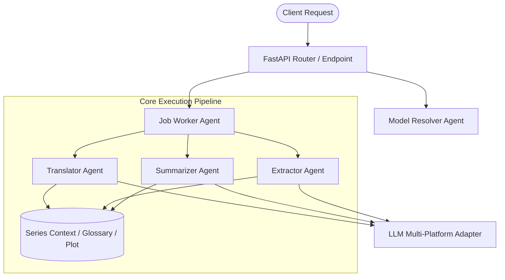
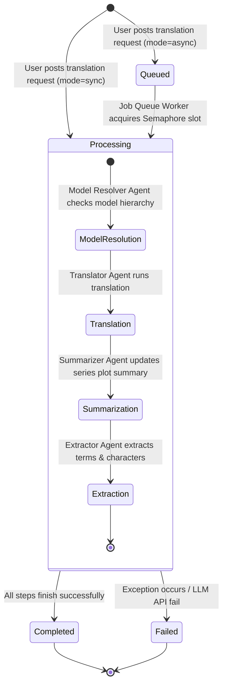

# AI Agents Specification & Architecture

This document defines the AI Agent architecture, operational flows, prompt strategies, context management, and execution policies for the **Novel Translation System**.

---

## 🤖 Overview of Agents

The system uses a decoupled, specialized multi-agent workflow to automate end-to-end web novel translation, context preservation, running plot summarization, and domain-specific terminology extraction.



---

## 🧠 Core AI Agents

### 1. Translator Agent (`src/services/translator.py`)
- **Primary Goal**: Translate novel source text (Chinese, Japanese, Korean, etc.) into high-quality fluent target language (English/Indonesian) while preserving tone, formatting, character voices, and style.
- **Context Injection**:
  - Injects character dictionaries (names, gender, speech style, relations).
  - Injects story glossary (terms, skill names, locations).
  - Injects running story summary (plot memory from previous chapters).
- **Execution Mode**: Synchronous or Async via Job Queue Worker.
- **Failover / Error Handling**: Validates empty output, handles platform rate limits, retries up to 3 times before failing job.

### 2. Summarizer Agent (`src/services/summarizer.py`)
- **Primary Goal**: Generate concise running plot summaries after chapter translation.
- **Memory Management**: Keeps cumulative narrative continuity across chapters, removing redundant events while retaining critical plot points, character introductions, and cliffhangers.
- **Input**: Original chapter text + translation output + existing series summary.
- **Output**: Updated multi-paragraph running plot summary.

### 3. Extractor Agent (`src/services/extractor.py`)
- **Primary Goal**: Parse translated and source text to automatically identify and extract new entities:
  - **Characters**: Name, translated name, gender, speech style, brief notes.
  - **Glossary Terms**: Source term, translation, domain/context notes.
- **Behavior**: Auto-deduplicates against existing database entities (`UNIQUE(series_id, name)` and `UNIQUE(series_id, term_source)`). Upserts new entries seamlessly.

### 4. Model Resolver Agent (`src/services/model_resolver.py`)
- **Primary Goal**: Resolves dynamic model configurations per request.
- **Features**:
  - Handles explicit `model_id` references.
  - Executes **Create-or-Append** logic for inline `platform` and `model` payloads.
  - Evaluates fallback hierarchy (Request Level -> Series Level -> Global Settings Default).

### 5. Job Queue Worker Agent (`src/services/job_worker.py`)
- **Primary Goal**: Background worker managing queued translation tasks asynchronously.
- **Features**:
  - Enforces `max_concurrent_jobs` via `asyncio.Semaphore`.
  - Scans `queued` and `processing` jobs on startup to recover interrupted operations after server restarts.
  - Updates job execution statuses (`queued` -> `processing` -> `completed` / `failed`).

---

## 📋 Agent Prompt Engineering & System Context

### Translator Agent System Prompt Template
```text
You are a professional literary translator specializing in web novels.
Translate the provided chapter accurately while maintaining tone, nuance, narrative flow, and character voice.

### Guidelines:
1. Translate into the target language requested.
2. Use exact terms from the Glossary provided below.
3. Consistently use specified character names, speech styles, and genders.
4. Maintain original paragraph structures and dialogue formatting.
5. Output ONLY the translated text without introductory commentary or footnotes.

### Glossary & Terms:
{glossary_formatted}

### Characters & Speech Styles:
{characters_formatted}

### Story Summary Context (Up to this point):
{series_summary}
```

### Extractor Agent System Prompt Template
```text
Analyze the novel chapter text below and extract newly introduced character names and unique terminology/glossary terms.

Return output strictly as a JSON object adhering to this JSON schema:
{
  "characters": [
    {
      "name": "Original Name",
      "translated_name": "Translated Name",
      "gender": "male | female | unknown",
      "speech_style": "polite | rude | archaic | casual",
      "notes": "Brief background or role"
    }
  ],
  "glossary": [
    {
      "term_source": "Original Term",
      "term_translation": "Translated Term",
      "notes": "Item, location, technique, or organization"
    }
  ]
}
```

---

## ⚡ Multi-Platform LLM Adapters

All agents communicate with LLMs through standardized adapter classes in `src/services/llm_adapters/`:

| API Type | Adapter Class | Payload Structure / API Protocol | Target Providers |
|---|---|---|---|
| `chat-completions` | `ChatCompletionsAdapter` | OpenAI `/v1/chat/completions` standard schema | OpenAI, AIHubMix, LocalAI, vLLM, Ollama, DeepSeek |
| `responses` | `ResponsesAdapter` | OpenAI `/v1/responses` format | OpenAI API modern endpoints |
| `messages` | `MessagesAdapter` | Anthropic `/v1/messages` schema | Anthropic Claude, Claude-compatible proxies |

### Smart Base URL Normalization
All LLM adapters feature automatic URL normalization. Whether the configured model `url` is provided as:
- Root domain: `https://aihubmix.com`
- Versioned path: `https://aihubmix.com/v1`
- Full endpoint: `https://aihubmix.com/v1/chat/completions`

The adapter automatically normalizes the URL to prevent double `/v1/v1` or duplicate endpoint path suffixes.

---

## 🔄 Agent Workflows & State Machine



---

## 🔒 Security & Concurrency Rules

1. **API Key Isolation**: Platform credentials (`api_key`) are decrypted and stored securely; keys are stripped from responses sent back to public APIs.
2. **Concurrency Control**: Concurrency is globally capped by `max_concurrent_jobs` configured in settings to prevent rate limit exhaustion and memory spikes.
3. **Database Integrity**: All agent database writes use SQLite WAL mode with full transaction safety and ON DELETE CASCADE constraints.
