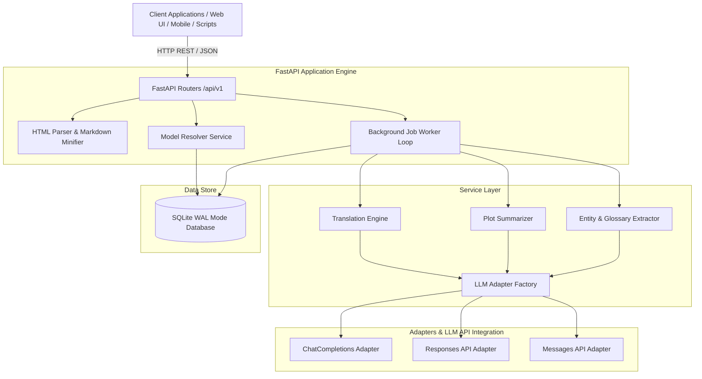
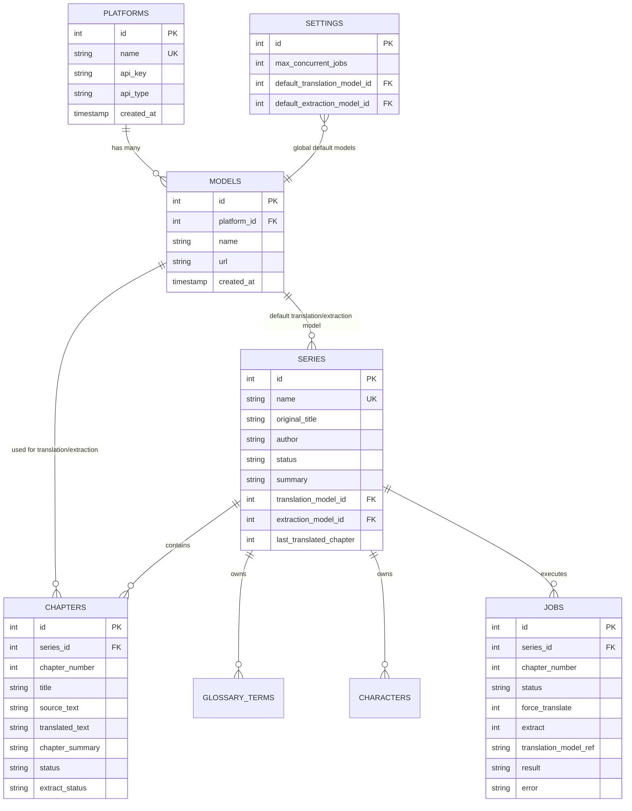
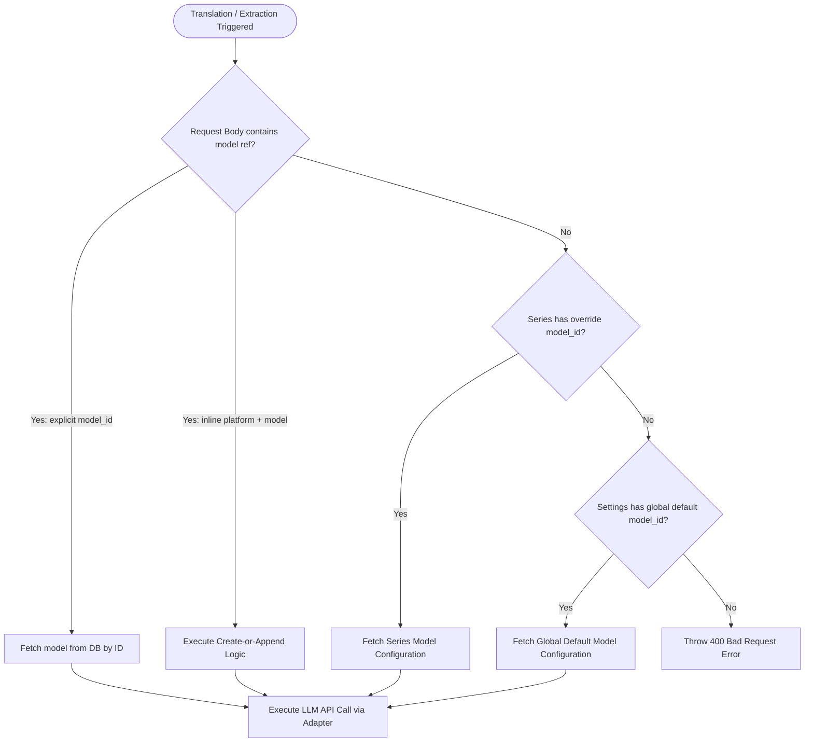

# System Architecture & Technical Specification

This document provides a comprehensive technical overview of the **Novel Translation API** backend system, data flow, database schemas, and service layer integration.

> 📖 **Per-Endpoint Data Flow & Flowcharts**: For detailed step-by-step Mermaid diagrams of each API endpoint process (ingress, parsing, model resolution, agent pipeline, database CRUD, and response formatting), see [ENDPOINT_FLOWCHARTS.md](file:///d:/Project_/2026/python/novel-trans-app/documentation/ENDPOINT_FLOWCHARTS.md).
> 🗄️ **Database Schema Specification**: For full column definitions, foreign keys, data types, and indexes, see [DATABASE_DESIGN.md](file:///d:/Project_/2026/python/novel-trans-app/documentation/DATABASE_DESIGN.md).

---

## 🏛️ High-Level System Architecture

The application is structured into decoupled layers following clean architecture principles: **API Routers**, **Service Orchestrators**, **Repositories**, and **Database Drivers**.

---

## 💻 Tech Stack & Specifications

| Layer | Technology | Specification / Details |
|---|---|---|
| **Runtime** | Python 3.14+ | Utilizing modern async/await syntax and optimized performance |
| **Package Manager** | `uv` | Ultra-fast Python package & virtualenv manager |
| **Web Framework** | FastAPI | High-performance ASGI framework with Pydantic v2 validation |
| **Database** | SQLite + `aiosqlite` | Asynchronous SQLite driver running with `PRAGMA journal_mode = WAL` |
| **Concurrency** | `asyncio.Semaphore` | Dynamic concurrency control with runtime setting adjustments |
| **Parsing** | BeautifulSoup4 / Selectolax | HTML cleanup, selector extraction, and markdown transformation |

---

## 📊 Relational Database Schema (SQLite)

The SQLite database (`data/novel_trans.db`) relies on foreign key enforcement (`PRAGMA foreign_keys = ON`) and WAL mode for efficient multi-process read/write operations.

---

## 🎯 Model Resolution Hierarchy

Model resolution dynamically determines which LLM configuration to execute for translation or extraction tasks based on a prioritized 3-tier hierarchy:

### Create-or-Append Rule Matrix
- **Existing Platform / Model**: If a platform or model with the matching name exists, only the non-null fields explicitly provided in the payload will be updated. Other existing fields (such as `api_key` or `url`) remain intact.
- **New Platform / Model**: Automatically inserts a new platform or model record into the database.

---

## ⏳ Async Job Queue & Worker System

1. **Job Lifecycle**:
   - `queued`: Added to database, waiting for execution slot.
   - `processing`: Worker acquired concurrency slot and actively translating/extracting.
   - `completed`: Successfully processed; results written to `chapters`, `series`, and `jobs.result`.
   - `failed`: Exception captured; error message recorded in `jobs.error`.

2. **Server Startup Recovery**:
   When the FastAPI lifespan starts, `JobWorkerService` automatically queries jobs with `status IN ('queued', 'processing')` and re-enqueues them into the asyncio worker loop. This ensures zero data loss during server restarts or deployment cycles.

3. **Concurrency Control**:
   `max_concurrent_jobs` can be dynamically altered via `PATCH /api/v1/settings`. The worker automatically adjusts its `asyncio.Semaphore` bound without requiring a server reboot.
