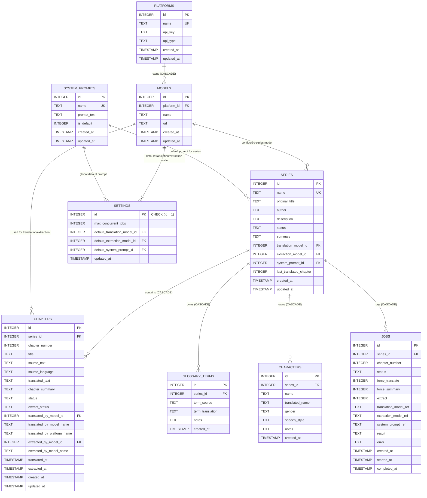

# 🗄️ SQLite Database Design & Schema Specification

This document provides the complete database architecture, table schemas, data types, foreign key relationships, constraints, and indexing strategy for the **Novel Translation System**.

---

## ⚙️ Database Engine Configuration

- **Database Engine**: SQLite 3 (via `aiosqlite` asynchronous driver)
- **Database File Path**: `data/novel_trans.db`
- **Concurrency & Transaction Mode**:
  ```sql
  PRAGMA journal_mode = WAL;      -- Write-Ahead Logging for high concurrency
  PRAGMA foreign_keys = ON;       -- Strictly enforces foreign key integrity & cascades
  ```

---

## 📐 Entity-Relationship Diagrams (ERD)

### 1. ASCII Art ERD Visualization

```text
+-------------------+             +------------------+             +------------------+
|  system_prompts   |             |    platforms     |             |      models      |
+-------------------+             +------------------+             +------------------+
| PK id             |             | PK id            |             | PK id            |
|    name (UNIQUE)  |             |    name (UNIQUE) | <---------+ | FK platform_id   |
|    prompt_text    |             |    api_key       |           | |    name (UNIQUE) |
|    is_default     |             |    api_type      |           | |    url           |
+-------------------+             +------------------+           | +------------------+
          ^                                                       |          ^
          |                                                       |          |
          +-----------------------------+-------------------------+          |
          |                             |                         |          |
+-------------------+         +-------------------+                       |
|     settings      |         |      series       | ----------------------+
+-------------------+         +-------------------+
| PK id (CHECK 1)   |         | PK id             |
| FK def_trans_m_id | ---->   |    name (UNIQUE)  |
| FK def_ext_m_id   | ---->   | FK trans_model_id | ----> (models.id)
| FK def_prompt_id  | ---->   | FK ext_model_id   | ----> (models.id)
+-------------------+         | FK sys_prompt_id  | ----> (system_prompts.id)
                              +-------------------+
                                        |
               +------------------------+------------------------+------------------------+
               |                        |                        |                        |
               v (CASCADE)              v (CASCADE)              v (CASCADE)              v (CASCADE)
     +-------------------+    +-------------------+    +-------------------+    +-------------------+
     |     chapters      |    |  glossary_terms   |    |    characters     |    |       jobs        |
     +-------------------+    +-------------------+    +-------------------+    +-------------------+
     | PK id             |    | PK id             |    | PK id             |    | PK id             |
     | FK series_id      |    | FK series_id      |    | FK series_id      |    | FK series_id      |
     |    chapter_number |    |    term_source    |    |    name           |    |    chapter_number |
     |    source_text    |    |    term_trans     |    |    trans_name     |    |    status         |
     |    translated_text|    |    notes          |    |    gender/speech  |    |    model_refs     |
     |    status         |    | UNIQUE(s_id,term) |    | UNIQUE(s_id,name) |    |    result/error   |
     | UNIQUE(s_id,ch_n) |    +-------------------+    +-------------------+    +-------------------+
     +-------------------+
```

### 2. Mermaid ERD Diagram



---

## 📄 Table Specifications & Constraints

### 1. `system_prompts` Table
Stores custom translation system prompt templates.

| Column | Type | Constraints | Description |
|---|---|---|---|
| `id` | `INTEGER` | `PRIMARY KEY AUTOINCREMENT` | Unique system prompt identifier |
| `name` | `TEXT` | `NOT NULL UNIQUE` | Human-readable prompt identifier (e.g., 'default', 'formal') |
| `prompt_text` | `TEXT` | `NOT NULL` | System prompt instruction template sent to LLMs |
| `is_default` | `INTEGER` | `DEFAULT 0` | 1 if default fallback prompt, 0 otherwise |
| `created_at` | `TIMESTAMP` | `DEFAULT CURRENT_TIMESTAMP` | Creation timestamp |
| `updated_at` | `TIMESTAMP` | `DEFAULT CURRENT_TIMESTAMP` | Modification timestamp |

---

### 2. `platforms` Table
Stores AI platform provider configurations (e.g., OpenAI, AIHubMix, Ollama).

| Column | Type | Constraints | Description |
|---|---|---|---|
| `id` | `INTEGER` | `PRIMARY KEY AUTOINCREMENT` | Unique platform identifier |
| `name` | `TEXT` | `NOT NULL UNIQUE` | Unique platform provider name (e.g., 'aihubmix') |
| `api_key` | `TEXT` | `NULLABLE` | Decrypted API key credential |
| `api_type` | `TEXT` | `NOT NULL DEFAULT 'chat-completions'` | API protocol format: `chat-completions`, `responses`, `messages` |
| `created_at` | `TIMESTAMP` | `DEFAULT CURRENT_TIMESTAMP` | Creation timestamp |
| `updated_at` | `TIMESTAMP` | `DEFAULT CURRENT_TIMESTAMP` | Modification timestamp |

---

### 3. `models` Table
Stores LLM model references associated with a specific platform.

| Column | Type | Constraints | Description |
|---|---|---|---|
| `id` | `INTEGER` | `PRIMARY KEY AUTOINCREMENT` | Unique model identifier |
| `platform_id` | `INTEGER` | `NOT NULL REFERENCES platforms(id) ON DELETE CASCADE` | FK pointing to parent platform |
| `name` | `TEXT` | `NOT NULL` | Model string name (e.g., 'gpt-4o', 'claude-3-5-sonnet') |
| `url` | `TEXT` | `NULLABLE` | Base URL endpoint override (e.g., `https://aihubmix.com/v1`) |
| `created_at` | `TIMESTAMP` | `DEFAULT CURRENT_TIMESTAMP` | Creation timestamp |
| `updated_at` | `TIMESTAMP` | `DEFAULT CURRENT_TIMESTAMP` | Modification timestamp |

> **Composite Constraint**: `UNIQUE(platform_id, name)` — Prevents duplicate model names on the same platform.

---

### 4. `settings` Table
Singleton configuration table storing global system defaults.

| Column | Type | Constraints | Description |
|---|---|---|---|
| `id` | `INTEGER` | `PRIMARY KEY CHECK (id = 1)` | Singleton ID constraint enforcing 1 row only |
| `max_concurrent_jobs` | `INTEGER` | `NOT NULL DEFAULT 3` | Maximum simultaneous worker slots (`asyncio.Semaphore`) |
| `default_translation_model_id` | `INTEGER` | `REFERENCES models(id)` | Global default model for translation |
| `default_extraction_model_id` | `INTEGER` | `REFERENCES models(id)` | Global default model for entity extraction |
| `default_system_prompt_id` | `INTEGER` | `REFERENCES system_prompts(id) DEFAULT 1` | Global default system prompt |
| `updated_at` | `TIMESTAMP` | `DEFAULT CURRENT_TIMESTAMP` | Modification timestamp |

---

### 5. `series` Table
Stores web novel series metadata and running plot summaries.

| Column | Type | Constraints | Description |
|---|---|---|---|
| `id` | `INTEGER` | `PRIMARY KEY AUTOINCREMENT` | Unique series identifier |
| `name` | `TEXT` | `NOT NULL UNIQUE` | Novel title |
| `original_title` | `TEXT` | `NULLABLE` | Original native language title |
| `author` | `TEXT` | `NULLABLE` | Author name |
| `title_alts` | `TEXT` | `NULLABLE` | Alternative titles |
| `description` | `TEXT` | `NULLABLE` | Series synopsis |
| `status` | `TEXT` | `DEFAULT 'ongoing'` | Publication status (`ongoing`, `completed`, `hiatus`) |
| `summary` | `TEXT` | `DEFAULT ''` | Cumulative multi-chapter running plot memory |
| `translation_model_id` | `INTEGER` | `REFERENCES models(id)` | Series override translation model |
| `extraction_model_id` | `INTEGER` | `REFERENCES models(id)` | Series override extraction model |
| `system_prompt_id` | `INTEGER` | `REFERENCES system_prompts(id)` | Series override system prompt |
| `last_translated_chapter` | `INTEGER` | `DEFAULT 0` | Highest chapter number translated |
| `created_at` | `TIMESTAMP` | `DEFAULT CURRENT_TIMESTAMP` | Creation timestamp |
| `updated_at` | `TIMESTAMP` | `DEFAULT CURRENT_TIMESTAMP` | Modification timestamp |

---

### 6. `chapters` Table
Stores raw novel text, clean Markdown, translations, and chapter summaries.

| Column | Type | Constraints | Description |
|---|---|---|---|
| `id` | `INTEGER` | `PRIMARY KEY AUTOINCREMENT` | Unique chapter identifier |
| `series_id` | `INTEGER` | `NOT NULL REFERENCES series(id) ON DELETE CASCADE` | FK pointing to parent series |
| `chapter_number` | `INTEGER` | `NOT NULL` | Chapter sequence number |
| `title` | `TEXT` | `NULLABLE` | Chapter title |
| `source_text` | `TEXT` | `NOT NULL` | Source language text (Cleaned Markdown or HTML) |
| `source_language` | `TEXT` | `NULLABLE` | Language code (`auto`, `zh`, `ja`, `ko`) |
| `translated_text` | `TEXT` | `NULLABLE` | Indonesian translated Markdown text |
| `chapter_summary` | `TEXT` | `NULLABLE` | Summary of events in this chapter |
| `status` | `TEXT` | `DEFAULT 'pending'` | Translation status (`pending`, `translated`, `failed`) |
| `extract_status` | `TEXT` | `DEFAULT 'pending'` | Extraction status (`pending`, `completed`, `skipped`, `failed`) |
| `translated_by_model_id` | `INTEGER` | `REFERENCES models(id)` | Model ID used for translation |
| `translated_by_model_name` | `TEXT` | `NULLABLE` | Snapshot of translation model name |
| `translated_by_platform_name` | `TEXT` | `NULLABLE` | Snapshot of platform provider name |
| `extracted_by_model_id` | `INTEGER` | `REFERENCES models(id)` | Model ID used for extraction |
| `extracted_by_model_name` | `TEXT` | `NULLABLE` | Snapshot of extraction model name |
| `translated_at` | `TIMESTAMP` | `NULLABLE` | Timestamp when translation completed |
| `extracted_at` | `TIMESTAMP` | `NULLABLE` | Timestamp when extraction completed |
| `created_at` | `TIMESTAMP` | `DEFAULT CURRENT_TIMESTAMP` | Creation timestamp |
| `updated_at` | `TIMESTAMP` | `DEFAULT CURRENT_TIMESTAMP` | Modification timestamp |

> **Composite Constraint**: `UNIQUE(series_id, chapter_number)` — Prevents duplicate chapter numbers within the same series.

---

### 7. `glossary_terms` Table
Stores series domain terms, skill names, locations, and translated terms.

| Column | Type | Constraints | Description |
|---|---|---|---|
| `id` | `INTEGER` | `PRIMARY KEY AUTOINCREMENT` | Unique glossary term identifier |
| `series_id` | `INTEGER` | `NOT NULL REFERENCES series(id) ON DELETE CASCADE` | FK pointing to parent series |
| `term_source` | `TEXT` | `NOT NULL` | Original source language term |
| `term_translation` | `TEXT` | `NOT NULL` | Target language translated term |
| `notes` | `TEXT` | `NULLABLE` | Category, domain notes, or usage instructions |
| `created_at` | `TIMESTAMP` | `DEFAULT CURRENT_TIMESTAMP` | Creation timestamp |

> **Composite Constraint**: `UNIQUE(series_id, term_source)` — Enables automatic upserts without duplicates.

---

### 8. `characters` Table
Stores series character definitions, translated names, gender, and speech styles.

| Column | Type | Constraints | Description |
|---|---|---|---|
| `id` | `INTEGER` | `PRIMARY KEY AUTOINCREMENT` | Unique character identifier |
| `series_id` | `INTEGER` | `NOT NULL REFERENCES series(id) ON DELETE CASCADE` | FK pointing to parent series |
| `name` | `TEXT` | `NOT NULL` | Original character name |
| `translated_name` | `TEXT` | `NULLABLE` | Translated character name |
| `gender` | `TEXT` | `NULLABLE` | Character gender (`male`, `female`, `unknown`) |
| `speech_style` | `TEXT` | `NULLABLE` | Speech style (`formal`, `polite`, `archaic`, `casual`, `rude`) |
| `notes` | `TEXT` | `NULLABLE` | Background notes or character relationships |
| `created_at` | `TIMESTAMP` | `DEFAULT CURRENT_TIMESTAMP` | Creation timestamp |

> **Composite Constraint**: `UNIQUE(series_id, name)` — Enables automatic upserts without duplicates.

---

### 9. `jobs` Table
Tracks async background translation job status and execution outputs.

| Column | Type | Constraints | Description |
|---|---|---|---|
| `id` | `INTEGER` | `PRIMARY KEY AUTOINCREMENT` | Unique job identifier |
| `series_id` | `INTEGER` | `NOT NULL REFERENCES series(id) ON DELETE CASCADE` | FK pointing to target series |
| `chapter_number` | `INTEGER` | `NOT NULL` | Target chapter sequence number |
| `status` | `TEXT` | `NOT NULL DEFAULT 'queued'` | Status (`queued`, `processing`, `completed`, `failed`) |
| `force_translate` | `INTEGER` | `DEFAULT 0` | Force re-translation flag (1 or 0) |
| `force_summary` | `INTEGER` | `DEFAULT 0` | Force re-summarization flag (1 or 0) |
| `extract` | `INTEGER` | `DEFAULT 1` | Run entity extraction flag (1 or 0) |
| `translation_model_ref` | `TEXT` | `NULLABLE` | JSON string snapshot of model reference |
| `extraction_model_ref` | `TEXT` | `NULLABLE` | JSON string snapshot of extraction model ref |
| `system_prompt_ref` | `TEXT` | `NULLABLE` | JSON string snapshot of system prompt ref |
| `result` | `TEXT` | `NULLABLE` | JSON string storing completion result payload |
| `error` | `TEXT` | `NULLABLE` | Error stacktrace string if status = 'failed' |
| `created_at` | `TIMESTAMP` | `DEFAULT CURRENT_TIMESTAMP` | Job enqueued timestamp |
| `started_at` | `TIMESTAMP` | `NULLABLE` | Job processing start timestamp |
| `completed_at` | `TIMESTAMP` | `NULLABLE` | Job completion/failure timestamp |

---

## ⚡ Performance Indexing Strategy

The database includes optimized indexes for lookup speed on foreign keys and status queries:

```sql
CREATE INDEX IF NOT EXISTS idx_chapters_status  ON chapters(status);
CREATE INDEX IF NOT EXISTS idx_chapters_series  ON chapters(series_id, chapter_number);
CREATE INDEX IF NOT EXISTS idx_glossary_series  ON glossary_terms(series_id);
CREATE INDEX IF NOT EXISTS idx_characters_series ON characters(series_id);
CREATE INDEX IF NOT EXISTS idx_models_platform   ON models(platform_id);
CREATE INDEX IF NOT EXISTS idx_jobs_status       ON jobs(status);
CREATE INDEX IF NOT EXISTS idx_jobs_series       ON jobs(series_id, chapter_number);
```
