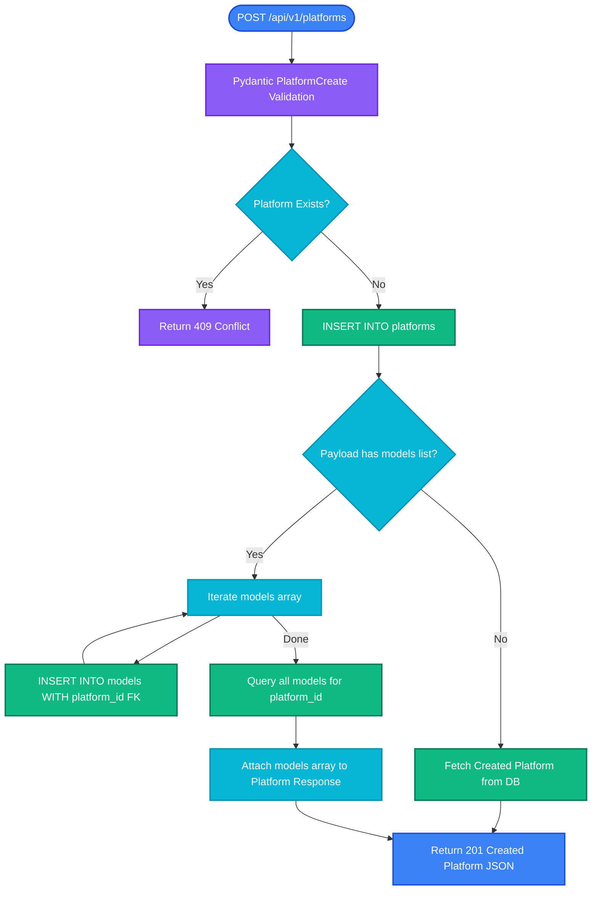
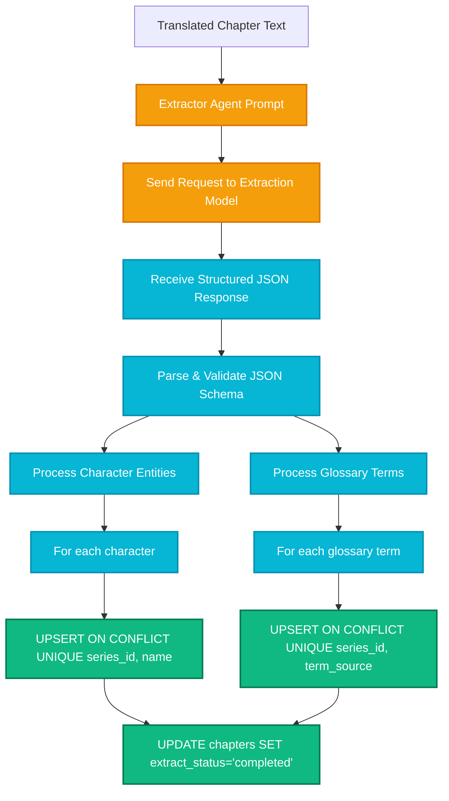
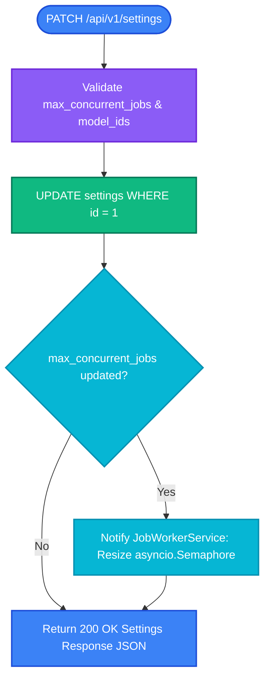
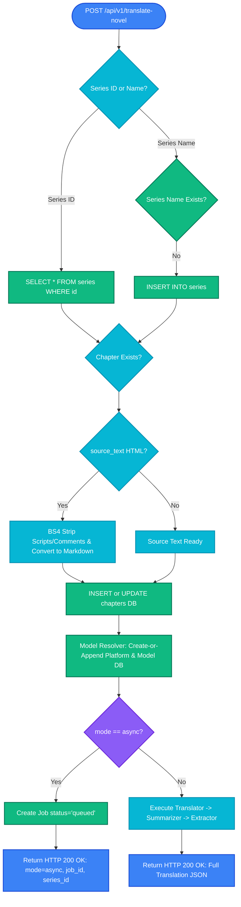

# 🔄 API Endpoints Flowchart & Execution Process Specification

This document provides a comprehensive visual and technical overview of the data lifecycle across all **Novel Translation System** endpoints.

Each section includes both **ASCII Art Flowcharts** (terminal-friendly visualization) and **Mermaid Diagrams**, detailing data progression from **User Request** $\rightarrow$ **Validation & HTML Cleaning** $\rightarrow$ **Model/Prompt Resolution** $\rightarrow$ **Agent Pipeline** $\rightarrow$ **SQLite WAL Persistence** $\rightarrow$ **JSON Output**.

---

## 🧭 Overall System Pipeline Architecture (ASCII Visual Legend)

```text
+------------------+      +-------------------+      +----------------------+      +----------------------+      +--------------------+
|  Client Request  | ---> |  FastAPI Router   | ---> | Cleaning / Resolver  | ---> | AI Agents & Adapters | ---> | SQLite WAL Database|
| (HTTP JSON/cURL) |      | (Pydantic / DTO)  |      | (BS4 HTML / Model)   |      | (Trans/Sum/Extract)  |      | (platforms, etc.)  |
+------------------+      +-------------------+      +----------------------+      +----------------------+      +--------------------+
```

---

## 🌐 1. Translation Endpoint Process (`POST /series/{id}/chapters/{n}/translate`)

Supports **Synchronous (Blocking)** and **Asynchronous (Background Job Queue)** execution.

### 1.1 ASCII Art Process Visualization

```text
[ USER / CLIENT REQUEST ]
  |  POST /api/v1/series/1/chapters/5/translate
  |  Payload: { "mode": "sync|async", "force_translate": false, "extract": true, "translation_model": {...} }
  v
+-----------------------------------------------------------------------------------+
| 1. ROUTER VALIDATION & CHAPTER LOOKUP                                             |
|    - Validate path parameters (series_id=1, chapter_number=5)                     |
|    - Query SQLite: SELECT * FROM chapters WHERE series_id=1 AND chapter_number=5 |
|    - If missing -> Return HTTP 404 Chapter Not Found                              |
|    - If status == 'translated' AND NOT force_translate -> Return HTTP 409 Conflict|
+-----------------------------------------------------------------------------------+
  |
  +-----------------------------------+----------------------------------+
  | (mode == "async")                 | (mode == "sync")                 |
  v                                   v
+-----------------------------+     +----------------------------------------------------+
| ASYNC JOB QUEUE BRANCH      |     | SYNC EXECUTION BRANCH                              |
|                             |     |                                                    |
| 1. Create Job record in DB  |     | 2. MODEL RESOLVER AGENT                            |
|    - status = 'queued'      |     |    - Check payload: Inline Platform/Model?         |
| 2. Return HTTP 200 OK:      |     |      -> Yes: Execute Create-or-Append in DB       |
|    {                        |     |      -> No: Check Series override -> Settings def |
|      "mode": "async",       |     |                                                    |
|      "job_id": 42,          |     | 3. TRANSLATOR AGENT                                |
|      "status_url": "/..."   |     |    - Fetch Context: Series plot summary + Glossary  |
|    }                        |     |      terms + Character speech definitions          |
| 3. Enqueue job into background|   |    - Resolve System Prompt (Default or Custom ID)   |
|    worker loop.             |     |    - Invoke LLM Adapter (ChatCompletions/Messages) |
+-----------------------------+     |    - Return translated text (Indonesian)           |
                                    |                                                    |
                                    | 4. SUMMARIZER AGENT                                |
                                    |    - Fetch previous chapter summary from DB        |
                                    |    - Invoke LLM API to update running plot memory  |
                                    |    - Return new chapter_summary                    |
                                    |                                                    |
                                    | 5. PERSIST TRANSLATION TO DB                       |
                                    |    - UPDATE chapters SET status='translated',      |
                                    |      translated_text=..., chapter_summary=...      |
                                    |    - UPDATE series SET last_translated_chapter=5   |
                                    |                                                    |
                                    | 6. EXTRACTOR AGENT (Optional: extract == true)     |
                                    |    - Resolve extraction model & platform           |
                                    |    - Call LLM API to parse new characters & terms  |
                                    |    - Parse JSON output                             |
                                    |    - UPSERT DB: INSERT OR IGNORE characters        |
                                    |      UNIQUE(series_id, name)                       |
                                    |    - UPSERT DB: INSERT OR IGNORE glossary_terms    |
                                    |      UNIQUE(series_id, term_source)                |
                                    |    - UPDATE chapters SET extract_status='completed'|
                                    |                                                    |
                                    | 7. RETURN RESPONSE                                 |
                                    |    - Return HTTP 200 OK JSON Result                |
                                    +----------------------------------------------------+
```

### 1.2 Mermaid Process Diagram

```mermaid
flowchart TD
    classDef client fill:#3b82f6,stroke:#1d4ed8,color:#ffffff,stroke-width:2px;
    classDef router fill:#8b5cf6,stroke:#6d28d9,color:#ffffff,stroke-width:2px;
    classDef process fill:#06b6d4,stroke:#0891b2,color:#ffffff,stroke-width:2px;
    classDef agent fill:#f59e0b,stroke:#d97706,color:#ffffff,stroke-width:2px;
    classDef db fill:#10b981,stroke:#047857,color:#ffffff,stroke-width:2px;
    classDef error fill:#ef4444,stroke:#b91c1c,color:#ffffff,stroke-width:2px;

    User([POST /series/{id}/chapters/{n}/translate]):::client --> ValidateChapter{Chapter Exists in DB?}:::router

    ValidateChapter -- No --> Err404[Return 404 Chapter Not Found]:::error
    ValidateChapter -- Yes --> CheckStatus{Status == translated AND NOT force_translate?}:::router

    CheckStatus -- Yes --> Err409[Return 409 Already Translated]:::error
    CheckStatus -- No --> ModeCheck{Request Mode?}:::router

    %% ASYNC BRANCH %%
    ModeCheck -- mode == async --> InsertJob[Insert Job record status='queued']:::db
    InsertJob --> AsyncResp[Return 200 OK: mode=async, job_id, status_url]:::client

    %% SYNC BRANCH %%
    ModeCheck -- mode == sync --> ResTransModel[Model Resolver: Resolve Translation Model]:::process
    ResTransModel --> TransAgent[1. Translator Agent]:::agent
    TransAgent --> FetchContext[Fetch Plot Memory + Glossary + Character Voices]:::db
    FetchContext --> SelectAdapter[Select LLM Adapter: ChatCompletions/Responses/Messages]:::process
    SelectAdapter --> LLMApi1[Call LLM Provider API]:::agent
    LLMApi1 --> GotTranslation[Receive Clean Translated Text]:::process

    GotTranslation --> SumAgent[2. Summarizer Agent]:::agent
    SumAgent --> LLMApi2[Call LLM API to Update Plot Memory]:::agent
    LLMApi2 --> GotSummary[Receive Updated Plot Summary]:::process

    GotSummary --> WriteChapterDB[UPDATE chapters SET status='translated']:::db
    WriteChapterDB --> UpdateSeriesDB[UPDATE series SET last_translated_chapter]:::db

    UpdateSeriesDB --> ExtractCheck{extract == true?}:::process
    ExtractCheck -- No --> SyncResp[Return 200 OK: Full Translation JSON]:::client

    ExtractCheck -- Yes --> ExtAgent[3. Extractor Agent]:::agent
    ExtAgent --> LLMApi3[Call LLM API: Extract Entities as JSON]:::agent
    LLMApi3 --> UpsertDB[UPSERT DB: Characters & Glossary Terms]:::db
    UpsertDB --> SyncResp
```

---

## ⏳ 2. Async Job Queue & Worker Lifecycle (`/api/v1/jobs`)

Manages asynchronous background processing using an `asyncio.Semaphore` queue with auto-recovery on server startup.

### 2.1 ASCII Art Process Visualization

```text
[ SERVER STARTUP / LIFESPAN ]
  |  1. Scan SQLite DB: SELECT * FROM jobs WHERE status IN ('queued', 'processing')
  |  2. Re-enqueue unfinished jobs into background asyncio task loop
  v
+-----------------------------------------------------------------------------------+
| BACKGROUND JOB WORKER LOOP                                                        |
|                                                                                   |
|     +--------------------+                                                        |
|     |  Job Queue (DB)    |                                                        |
|     | status = 'queued'  |                                                        |
|     +--------------------+                                                        |
|               |                                                                   |
|               v                                                                   |
|     +----------------------------------------------------+                        |
|     | Acquire asyncio.Semaphore Slot                     |                        |
|     | (Max concurrent limit set in /settings e.g. 3)     |                        |
|     +----------------------------------------------------+                        |
|               |                                                                   |
|               v                                                                   |
|     +----------------------------------------------------+                        |
|     | UPDATE jobs SET status = 'processing'              |                        |
|     +----------------------------------------------------+                        |
|               |                                                                   |
|               v                                                                   |
|     +----------------------------------------------------+                        |
|     | Execute Pipeline:                                  |                        |
|     |   Translator Agent -> Summarizer Agent -> Extractor|                        |
|     +----------------------------------------------------+                        |
|               |                                                                   |
|       +-------+-------+                                                           |
|       |               |                                                           |
| (Success)         (Error/Fail)                                                    |
|       v               v                                                           |
| +-----------+   +-----------+                                                     |
| | UPDATE    |   | UPDATE    |                                                     |
| | jobs SET  |   | jobs SET  |                                                     |
| | status =  |   | status =  |                                                     |
| |'completed'|   | 'failed', |                                                     |
| | result=.. |   | error=... |                                                     |
| +-----------+   +-----------+                                                     |
+-----------------------------------------------------------------------------------+

[ CLIENT POLLING ]
  |  GET /api/v1/jobs/42
  v
+-----------------------------------------------------------------------------------+
| QUERY DB FOR JOB STATUS                                                           |
|   - Return JSON: { "id": 42, "status": "completed|processing|failed", ... }       |
+-----------------------------------------------------------------------------------+
```

### 2.2 Mermaid Process Diagram

```mermaid
flowchart TD
    classDef client fill:#3b82f6,stroke:#1d4ed8,color:#ffffff,stroke-width:2px;
    classDef process fill:#06b6d4,stroke:#0891b2,color:#ffffff,stroke-width:2px;
    classDef db fill:#10b981,stroke:#047857,color:#ffffff,stroke-width:2px;

    SubStart([Server Startup / Lifespan]) --> Recovery[Worker Scans DB for queued/processing jobs]:::process
    Recovery --> ReEnqueue[Re-enqueue Pending Jobs into Asyncio Loop]:::process

    UserReq([POST /translate mode=async]):::client --> CreateJob[Create Job Record status='queued']:::db
    CreateJob --> QueueLoop[Background Worker Job Queue]:::process

    QueueLoop --> AcquireSem{Acquire asyncio.Semaphore Slot?}:::process
    AcquireSem -- Slot Granted --> ProcessingState[UPDATE jobs SET status='processing']:::db
    ProcessingState --> ExecPipeline[Execute Translation -> Summarization -> Extraction Pipeline]:::process

    ExecPipeline -- Success --> JobSuccess[UPDATE jobs SET status='completed', result=...]:::db
    ExecPipeline -- Fail --> JobFailed[UPDATE jobs SET status='failed', error=...]:::db

    UserPoll([GET /api/v1/jobs/{job_id}]):::client --> FetchJob[SELECT * FROM jobs WHERE id = job_id]:::db
    FetchJob --> JobResp[Return Job Status & Result Payload]:::client
```

---

## 🌐 3. Platform & Model Management (`/api/v1/platforms`, `/api/v1/models`)

Supports single platform creation AND simultaneous Platform + Models registration in a single payload.

### 3.1 ASCII Art Process Visualization

```text
[ CLIENT REQUEST ]
  |  POST /api/v1/platforms
  |  Payload:
  |  {
  |    "name": "aihubmix",
  |    "api_key": "sk-secret",
  |    "api_type": "chat-completions",
  |    "models": [
  |      { "name": "gpt-4o", "url": "https://aihubmix.com/v1" },
  |      { "name": "claude-3-5-sonnet", "url": "https://aihubmix.com/v1" }
  |    ]
  |  }
  v
+-----------------------------------------------------------------------------------+
| 1. PYDANTIC SCHEMA VALIDATION (PlatformCreate)                                    |
|    - Validate fields & alias mappings (apiKey -> api_key, apiType -> api_type)    |
|    - Parse optional nested models array                                           |
+-----------------------------------------------------------------------------------+
  |
  v
+-----------------------------------------------------------------------------------+
| 2. DB DUPLICATE CHECK                                                             |
|    - SELECT * FROM platforms WHERE name = 'aihubmix'                              |
|    - If exists -> Return HTTP 409 Conflict Platform Already Exists                |
+-----------------------------------------------------------------------------------+
  |
  v
+-----------------------------------------------------------------------------------+
| 3. PLATFORM INSERTION                                                             |
|    - INSERT INTO platforms (name, api_key, api_type) VALUES (...)                 |
|    - Get inserted cursor.lastrowid -> platform_id                                 |
+-----------------------------------------------------------------------------------+
  |
  v
+-----------------------------------------------------------------------------------+
| 4. NESTED MODELS INSERTION (If models array present)                              |
|    - For each model in payload.models:                                            |
|        INSERT INTO models (platform_id, name, url) VALUES (platform_id, ...)     |
+-----------------------------------------------------------------------------------+
  |
  v
+-----------------------------------------------------------------------------------+
| 5. RESPONSE ASSEMBLY                                                              |
|    - SELECT * FROM models WHERE platform_id = platform_id                         |
|    - Attach models list to platform response dict                                 |
|    - Return HTTP 201 Created:                                                     |
|      {                                                                            |
|        "id": 1,                                                                   |
|        "name": "aihubmix",                                                        |
|        "api_type": "chat-completions",                                            |
|        "models": [                                                                |
|          { "id": 1, "platform_id": 1, "name": "gpt-4o", "url": "..." },           |
|          { "id": 2, "platform_id": 1, "name": "claude-3-5-sonnet", "url": "..." }   |
|        ]                                                                          |
|      }                                                                            |
+-----------------------------------------------------------------------------------+
```

### 3.2 Mermaid Process Diagram



---

## 📄 4. Chapter Creation & HTML Cleanup Process (`POST /series/{id}/chapters`)

Converts web novel HTML scrapings into cleaned, minified Markdown before storing into SQLite.

### 4.1 ASCII Art Process Visualization

```text
[ CLIENT REQUEST ]
  |  POST /api/v1/series/1/chapters
  |  Payload: { "chapter_number": 5, "title": "...", "source_text": "<div><h1>Title</h1><p>Text...</p></div>" }
  v
+-----------------------------------------------------------------------------------+
| 1. SERIES & DUPLICATE CHAPTER CHECK                                               |
|    - Verify series_id exists in DB                                                |
|    - Check SELECT * FROM chapters WHERE series_id=1 AND chapter_number=5          |
+-----------------------------------------------------------------------------------+
  |
  v
+-----------------------------------------------------------------------------------+
| 2. HTML PARSER & CLEANING PIPELINE (src/html_parser.py)                           |
|                                                                                   |
|   +---------------------------------------------------------------------------+   |
|   | BeautifulSoup4 DOM Parsing                                                |   |
|   |   - Parse source_text into HTML tree                                      |   |
|   +---------------------------------------------------------------------------+   |
|                                 |                                                 |
|                                 v                                                 |
|   +---------------------------------------------------------------------------+   |
|   | Strip Unwanted Elements & Comments                                        |   |
|   |   - Remove: <script>, <style>, <meta>, <head>, <noscript>, <iframe>,    |   |
|   |             <video>, <audio>, <nav>, <footersys>, <aside>, <svg>, comments|   |
|   +---------------------------------------------------------------------------+   |
|                                 |                                                 |
|                                 v                                                 |
|   +---------------------------------------------------------------------------+   |
|   | Map HTML Tags to Markdown                                                 |   |
|   |   - <strong> / <b> -> **bold**                                            |   |
|   |   - <em> / <i>     -> *italic*                                            |   |
|   |   - <h1>..<h6>     -> # .. ######                                         |   |
|   |   - <hr>           -> ***                                                 |   |
|   |   - <blockquote >  -> > quote                                             |   |
|   +---------------------------------------------------------------------------+   |
|                                 |                                                 |
|                                 v                                                 |
|   +---------------------------------------------------------------------------+   |
|   | Minify & Normalize Markdown                                               |   |
|   |   - RegEx collapse multiple spaces/tabs: [ \t]+ -> ' '                    |   |
|   |   - Strip leading/trailing whitespace per line                            |   |
|   |   - Collapse 3+ newlines into double newlines (\n\n)                      |   |
|   +---------------------------------------------------------------------------+   |
+-----------------------------------------------------------------------------------+
  |
  v
+-----------------------------------------------------------------------------------+
| 3. PERSIST TO SQLITE DATABASE                                                     |
|    - INSERT INTO chapters (series_id, chapter_number, title, source_text, status) |
|      VALUES (1, 5, '...', clean_md_text, 'pending')                              |
|    - Return HTTP 201 Created Chapter JSON                                         |
+-----------------------------------------------------------------------------------+
```

### 4.2 Mermaid Process Diagram

```mermaid
flowchart TD
    classDef client fill:#3b82f6,stroke:#1d4ed8,color:#ffffff,stroke-width:2px;
    classDef router fill:#8b5cf6,stroke:#6d28d9,color:#ffffff,stroke-width:2px;
    classDef process fill:#06b6d4,stroke:#0891b2,color:#ffffff,stroke-width:2px;
    classDef db fill:#10b981,stroke:#047857,color:#ffffff,stroke-width:2px;

    UserChapReq([POST /api/v1/series/{id}/chapters]):::client --> CheckSeries{Series Exists in DB?}:::router
    CheckSeries -- No --> Err404Series[Return 404 Not Found]:::router
    CheckSeries -- Yes --> CheckChapterDup{Chapter Number Exists?}:::router
    CheckChapterDup -- Yes --> Err409Chap[Return 409 Conflict]:::router

    CheckChapterDup -- No --> DetectHTML{Is source_text HTML?}:::process
    DetectHTML -- Yes HTML --> BS4Parser[1. BeautifulSoup4 DOM Tree]:::process
    BS4Parser --> StripComments[2. Remove Comments, Scripts, Styles, Nav, Iframes]:::process
    StripComments --> MapTags[3. Map Tags to Markdown: strong->**, em->*, h1->#]:::process
    MapTags --> MinifyMD[4. Minify Markdown & Normalize Whitespace]:::process
    MinifyMD --> CleanedText[Cleaned Source Text Ready]:::process

    DetectHTML -- Plain Text --> CleanedText

    CleanedText --> DBInsertChap[INSERT INTO chapters status='pending']:::db
    DBInsertChap --> ReturnChap[Return 201 Created Chapter JSON]:::client
```

---

## 👥 5. Character & Glossary Auto-Extraction & Deduplication

Extracts character profiles and novel terms post-translation and auto-deduplicates against SQLite unique constraints.

### 5.1 ASCII Art Process Visualization

```text
[ TRANSLATED CHAPTER TEXT ]
  |
  v
+-----------------------------------------------------------------------------------+
| 1. EXTRACTOR AGENT PROMPT EXECUTION                                               |
|    - Send translated text to extraction model                                      |
|    - Prompt requests JSON conforming to schema:                                    |
|      {                                                                            |
|        "characters": [ { "name": "..", "translated_name": "..", "gender": ".." } ],|
|        "glossary":   [ { "term_source": "..", "term_translation": ".." } ]         |
|      }                                                                            |
+-----------------------------------------------------------------------------------+
  |
  v
+-----------------------------------------------------------------------------------+
| 2. JSON PARSING & DB DEDUPLICATION PIPELINE                                       |
|                                                                                   |
|    +----------------------------------+    +----------------------------------+   |
|    | CHARACTERS DEDUPLICATION         |    | GLOSSARY TERMS DEDUPLICATION     |   |
|    |                                  |    |                                  |   |
|    | For item in characters[]:        |    | For item in glossary[]:          |   |
|    |   INSERT INTO characters         |    |   INSERT INTO glossary_terms     |   |
|    |   (series_id, name, ...)         |    |   (series_id, term_source, ...)  |   |
|    |   ON CONFLICT (series_id, name)  |    |   ON CONFLICT (series_id, term)  |   |
|    |   DO UPDATE SET                  |    |   DO UPDATE SET                  |   |
|    |   translated_name=EXCLUDED...,   |    |   term_translation=EXCLUDED...,  |   |
|    |   notes=EXCLUDED...              |    |   notes=EXCLUDED...              |   |
|    +----------------------------------+    +----------------------------------+   |
+-----------------------------------------------------------------------------------+
  |
  v
+-----------------------------------------------------------------------------------+
| 3. UPDATE CHAPTER STATUS                                                          |
|    - UPDATE chapters SET extract_status = 'completed', extracted_at = NOW()       |
+-----------------------------------------------------------------------------------+
```

### 5.2 Mermaid Process Diagram



---

## ⚙️ 6. System Settings & Dynamic Concurrency Control (`PATCH /settings`)

Modifies system defaults and worker concurrency capacity at runtime without server reboot.

### 6.1 ASCII Art Process Visualization

```text
[ CLIENT REQUEST ]
  |  PATCH /api/v1/settings
  |  Payload: { "max_concurrent_jobs": 5, "default_translation_model_id": 2 }
  v
+-----------------------------------------------------------------------------------+
| 1. VALIDATION & DB UPDATE                                                         |
|    - Validate max_concurrent_jobs >= 1                                            |
|    - Validate model_ids exist in models table                                     |
|    - UPDATE settings SET max_concurrent_jobs=5, default_translation_model_id=2    |
|      WHERE id = 1                                                                 |
+-----------------------------------------------------------------------------------+
  |
  v
+-----------------------------------------------------------------------------------+
| 2. DYNAMIC WORKER SEMAPHORE RESIZE                                                |
|    - If max_concurrent_jobs changed:                                              |
|      Notify JobWorkerService -> Update internal asyncio.Semaphore bound           |
|    - No server restart required!                                                  |
+-----------------------------------------------------------------------------------+
  |
  v
+-----------------------------------------------------------------------------------+
| 3. RETURN RESPONSE                                                                |
|    - Return HTTP 200 OK Settings JSON Response                                    |
+-----------------------------------------------------------------------------------+
```

### 6.2 Mermaid Process Diagram



## 🚀 7. All-In-One Unified Endpoint Flowchart (`POST /api/v1/translate-novel`)

Combines Series resolution/creation, HTML parsing/cleaning, Chapter creation, Platform/Model Create-or-Append, and Translation in a single HTTP request.

### 7.1 ASCII Art Process Visualization

```text
[ USER UNIFIED REQUEST ]
  |  POST /api/v1/translate-novel
  |  Payload: { "series": {...}, "chapter": {...}, "translationModel": { "platform": { "name": "...", "models": [...] } } }
  v

+-----------------------------------------------------------------------------------+
| 1. SERIES RESOLUTION & ON-THE-FLY CREATION                                        |
|    - Check payload: Is series.id provided? -> Query DB by ID                      |
|    - Else: Query DB by series.name -> If missing, INSERT INTO series              |
+-----------------------------------------------------------------------------------+
  |
  v
+-----------------------------------------------------------------------------------+
| 2. CHAPTER RESOLUTION & HTML CLEANING PIPELINE                                    |
|    - Check if chapter exists for series_id AND chapter_number                     |
|    - If source_text is HTML -> Run bs4 comment/script stripping & tag mapping     |
|    - If chapter missing -> INSERT INTO chapters (status='pending', clean_text)    |
|    - If chapter exists  -> UPDATE chapters SET source_text = clean_text           |
+-----------------------------------------------------------------------------------+
  |
  v
+-----------------------------------------------------------------------------------+
| 3. INLINE MODEL & PLATFORM RESOLUTION (Model Resolver Agent)                       |
|    - Execute Create-or-Append logic: INSERT/UPDATE platforms AND models in DB     |
+-----------------------------------------------------------------------------------+
  |
  v
+-----------------------------------------------------------------------------------+
| 4. EXECUTION DISPATCH (Sync vs Async)                                             |
|    - If mode == 'async' -> Create job (status='queued') & return immediately      |
|    - If mode == 'sync'  -> Execute Translator -> Summarizer -> Extractor -> DB    |
|      Return HTTP 200 OK result JSON with series_id and series_name                |
+-----------------------------------------------------------------------------------+
```

### 7.2 Mermaid Process Diagram



---

## 📊 Summary Table of Data Processing Pipeline

| Stage | Process Description | Technology / Components | Output Artifact |
|---|---|---|---|
| **1. Ingress & Routing** | Validates HTTP method, path parameters, header tokens, and JSON body schema. | FastAPI + Pydantic v2 | Validated DTO / HTTPException |
| **2. Text Pre-Processing** | Strips comments, script tags, converts HTML elements to Markdown, normalizes whitespace. | BeautifulSoup4 + RegEx | Cleaned Markdown Source Text |
| **3. Model Resolution** | Evaluates explicit request model refs, Series overrides, and Settings defaults. Creates missing platforms/models on-the-fly. | Model Resolver Agent (`model_resolver.py`) | Model & Platform DB Dicts |
| **4. Context Injection** | Merges series plot memory, character voices, glossary terms, and custom system prompt. | Context Manager / Repositories | Formatted System & User Prompt |
| **5. LLM API Execution** | Translates prompt into provider-specific API payloads (`chat-completions`, `responses`, `messages`). | LLM Adapter Factory (`llm_adapters/`) | Clean Raw Model Text Output |
| **6. Summarization & Memory** | Generates updated cumulative plot summary of chapter narrative continuity. | Summarizer Agent (`summarizer.py`) | Updated Narrative Plot Summary |
| **7. Entity Extraction** | Extracts newly introduced characters & terms; deduplicates via `UNIQUE` DB constraints. | Extractor Agent (`extractor.py`) | Character & Glossary DB Records |
| **8. Egress & Persistence** | Commits chapter status, translation results, and timestamps to SQLite WAL database. | `aiosqlite` WAL Mode | HTTP 200/201 JSON Response |

